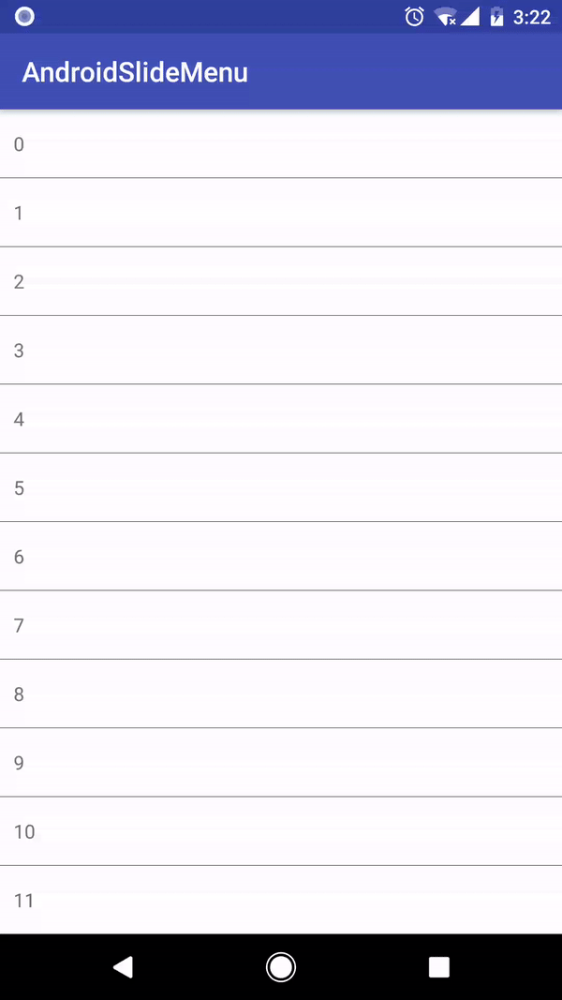

# Preview



# How to use

1. Use `SlideMenuLayout` as your list item view's root.
```
<com.zongzhan.slidemenu.SlideMenuLayout xmlns:android="http://schemas.android.com/apk/res/android"
    xmlns:app="http://schemas.android.com/apk/res-auto"
    xmlns:tools="http://schemas.android.com/tools"
    android:layout_width="match_parent"
    android:layout_height="50dp"
    tools:context="com.zongzhan.androidslidemenu.MainActivity">

    <TextView
        android:id="@+id/text"
        android:layout_width="match_parent"
        android:layout_height="match_parent"
        android:gravity="center_vertical"
        android:background="#FFFFFF"
        tools:text="Two Menu" />
    <ImageView
        android:id="@+id/menu1"
        android:layout_width="50dp"
        android:padding="10dp"
        android:layout_height="match_parent"
        android:gravity="center"
        android:background="@color/colorPrimary"
        android:src="@android:drawable/ic_menu_share"/>
    <ImageView
        android:id="@+id/menu2"
        android:layout_width="50dp"
        android:padding="10dp"
        android:layout_height="match_parent"
        android:gravity="center"
        android:background="@color/colorPrimaryDark"
        android:src="@android:drawable/ic_menu_delete" />
</com.zongzhan.slidemenu.SlideMenuLayout>
```

2. Extend `SlideMenuItemViewHolder`
```
class MyViewHolder extends SlideMenuItemViewHolder {
    TextView textView;
    public MyViewHolder(SlideMenuListAdapter adapter, View itemView) {
        super(adapter, itemView);
        textView = itemView.findViewById(R.id.text);
    }
    public void setText(String s) {
        textView.setText(s);
    }
}
```
3. Extend `SlideMenuAdapter`
```
class MyAdapter extends SlideMenuListAdapter<MyViewHolder> {
    @Override
    public MyViewHolder onCreateViewHolder(ViewGroup parent, int viewType) {
        return new MyViewHolder(this, LayoutInflater.from(parent.getContext()).inflate(R.layout.item2, parent, false));
    }

    @Override
    public void onBindViewHolder(MyViewHolder holder, int position) {
        holder.setText(String.valueOf(position));
    }

    @Override
    public int getItemCount() {
        return 30;
    }

}
```
4. Set the adapter to your recycler view.
